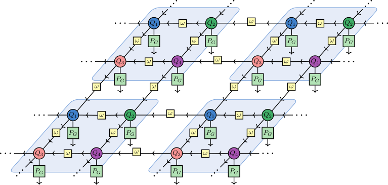

<h1> 
 Larger unit cell implementation 
 </h1>

The following generalization to larger unit cells is based on the implementation of <a href="https://journals.aps.org/prb/abstract/10.1103/PhysRevB.101.115134"> Hackenbroich et al. </a>.

<figure>
  
  <figcaption> 
 Fig.1 - 2x2 unit cell, where each unit cell consits of 4 coarse grained local tensors. 
 </figcaption>
</figure>

The central idea is to coarse grain the tensors within the unit cell as illustrated in Fig. 1.
This now is our new fiducial state which is again a fermionic Gaussian state, and is fully described by a covariance matrix. This is an antisymmetric matrix and can be expressed as:

$$
% \begin{equation}
    \Gamma_\text{uc} = \begin{pmatrix}
        \mathcal{A}_p & \mathcal{B}_{pv_h} & \mathcal{B}_{pv_v} \\
        -\mathcal{B}_{p v_h}^T & \mathcal{D}_{v_h} & \mathcal{B}_{v_h v_v} \\
        -\mathcal{B}_{p v_v}^T & -\mathcal{B}_{v_h v_v}^T & \mathcal{D}_{v_v}
    \end{pmatrix}
% \end{equation}
The diagonal blocks $\mathcal{A}_p, \mathcal{D}_{v_h}$ and $\mathcal{D}_{v_v}$ describe the physical, horizontal (left and right) virtual and vertical (up and down) virtual subsystem, respectively.
The off-diagonal blocks describe the coupling between these three subsystems.
One can combine these blocks into
% \begin{equation}
% \begin{aligned}
    \mathcal{A} = \mathcal{A}_p, \quad
    \mathcal{B} = \begin{pmatrix} \mathcal{B}_{p v_h} & \mathcal{B}_{p v_v} \end{pmatrix}, \quad
    \mathcal{D} = \begin{pmatrix}
        \mathcal{D}_{v_h} & \mathcal{B}_{v_h v_v} \\
        -\mathcal{B}_{v_h v_v}^T & \mathcal{D}_{v_v}
    \end{pmatrix}
% \end{aligned}
% \end{equation}
$$
such that $\Gamma_\text{uc}$ has the same form as \eqref{eq:general_form_Gamma_A}.

\begin{figure}
    \centering
    \includegraphics[width=1.0\linewidth]{tikzstandalones/method/GfPEPS/fiducial_state_with_gutzwiller_larger_unit_cell_new.pdf}
    \caption{The \gls{iPEPS} for a $2 \times 2$ unit cell (light blue squares) with four distinct local fiducial states $\ket{Q_1}, \ket{Q_2}, \ket{Q_3}$ and $\ket{Q_4}$ in each unit cell. The virtual links are projected to the basis of maximally entangled states via the projector $\ket{\omega} \bra{\omega}$ (yellow squares).}
    \label{fig:fiducial_state_with_gutzwiller_larger_unit_cell_new}
\end{figure}

Again, moving to Fourier space as our system is translation invariant, we must also formulate the Fourier transformed \gls{cm} of the virtual system for the larger unit cell.
With the same ordering of the Majorana modes as $\mathcal{D}$, the Fourier transformed \gls{cm} of the virtual system can be written as:
\begin{equation}
    \mathcal{G}_{\mathbf{k}}^{(\omega)} = \left[ 
            \bigoplus_{\mu=1}^\Lambda \mathcal{G}_{\mathbf{k}}^{(\omega, x)} \right] 
        \oplus 
        \left[ 
            \bigoplus_{\nu=1}^\Lambda \mathcal{G}_{\mathbf{k}}^{(\omega, y)} 
        \right]
    \eqcomm
\end{equation}
where $\mathcal{G}_{\mathbf{k}}^{(\omega, x)}$ ($\mathcal{G}_{\mathbf{k}}^{(\omega, y)}$) is the Fourier transformed \gls{cm} of the horizontal (vertical) bonds.
For example for a $2 \times 2$ unit cell, the Fourier transformed \gls{cm} for the horizontal bonds takes the form \cite{Hackenbroich_Bernevig_Schuch_Regnault_2020}
\begin{equation}
    \mathcal{G}_{\mathbf{k}}^{(\omega, x)} = \begin{pmatrix}
        0 & 0 & -e^{- i k_x} \sigma_x & 0 \\
        0 & 0 & 0 & -e^{- i k_x} \sigma_x \\
        e^{- i k_x} \sigma_x  & 0 & 0  & 0 \\
        0 & e^{- i k_x} \sigma_x & 0 & 0 \\
    \end{pmatrix}
\eqcomm
\end{equation}
where we order the virtual Majorana fermions like in \eqref{eq:CM_virtual_system_majorana} with the same directions of the horizontal and vertical bonds \footnote{Note that in \cite{Hackenbroich_Bernevig_Schuch_Regnault_2020} the direction of the vertical bonds is reversed compared to ours. This results in $k_x \to -k_x$, where the negative sign indicates that the bonds are oriented from right to left.}.
The Fourier transformed \gls{cm} for the vertical bonds is constructed in a similar way.

After these adjustments, the \gls{cm} of the total state can again be computed via a Schur complement and has the same form as \eqref{eq:general_form_Gaussian_map_fourier}:
\begin{equation}
    \label{eq:general_form_Gaussian_map_fourier_bigger_uc}
    \mathcal{G}_\bold{k}^{(\Psi)} = \mathcal{B} \left(\mathcal{D} + \mathcal{G}_\bold{k}^{(\omega)} \right)^{-1} \mathcal{B}^T + \mathcal{A}
    \eqstop
\end{equation}
Now the steps are equivalent as before and one finds the optimal $\Gamma_\text{uc}$ that minimizes the energy of a given fermionic quadratic Hamiltonians for the desired unit cell layout by using \autoref{alg:energy_loss}.
This step, however, needs further investigation, as we need to define the energy expectation value now in terms of the \gls{cm} of the fiducial state of the unit cell.
After that, one can translate the \gls{cm} of the fiducial state of the unit cell using \autoref{alg:translation}, project it onto the maximally entangled bonds,and apply the Gutzwiller projection to the physical legs using \autoref{alg:projection}.
The \gls{iPEPS} is then formed by repeating the unit cell over the infinite lattice.